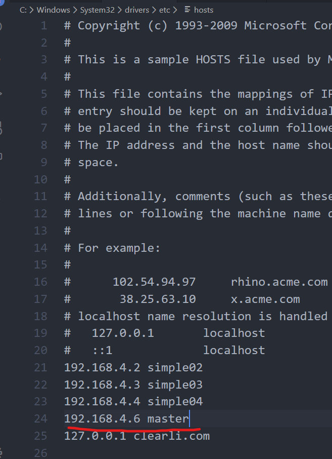

### 版本hbase1.6.0+hadoop2.7.1

由于最近上课在讲hbase的API，特此来记录一下


### 改写Ubuntu的hosts文件


改本地hosts文件



### 创建maven工程加入依赖如下

```xml
<dependencies>
  <dependency>
    <groupId>junit</groupId>
    <artifactId>junit</artifactId>
    <version>4.11</version>
    <scope>test</scope>
  </dependency>
  <dependency>
    <groupId>org.springframework.boot</groupId>
    <artifactId>spring-boot-starter-web</artifactId>
  </dependency>

  <dependency>
    <groupId>org.springframework.data</groupId>
    <artifactId>spring-data-hadoop-boot</artifactId>
    <version>2.5.0.RELEASE</version>
    <exclusions>
      <exclusion>
        <artifactId>jsp-api</artifactId>
        <groupId>javax.servlet.jsp</groupId>
      </exclusion>
    </exclusions>
    <!--<exclusions>
      <exclusion>
        <groupId>javax.servlet</groupId>
        <artifactId>servlet-api</artifactId>
      </exclusion>
    </exclusions>-->
  </dependency>
  <dependency>
    <groupId>org.springframework.data</groupId>
    <artifactId>spring-data-hadoop</artifactId>
    <version>2.5.0.RELEASE</version>
    <exclusions>
      <exclusion>
        <groupId>org.slf4j</groupId>
        <artifactId>slf4j-log4j12</artifactId>
      </exclusion>
      <exclusion>
        <groupId>log4j</groupId>
        <artifactId>log4j</artifactId>
      </exclusion>
      <exclusion>
        <groupId>javax.servlet</groupId>
        <artifactId>servlet-api</artifactId>
      </exclusion>
    </exclusions>
  </dependency>
  <dependency>
    <groupId>org.apache.hbase</groupId>
    <artifactId>hbase-client</artifactId>
    <version>1.6.0</version>
    <exclusions>
      <exclusion>
        <groupId>org.slf4j</groupId>
        <artifactId>slf4j-log4j12</artifactId>
      </exclusion>
      <exclusion>
        <groupId>log4j</groupId>
        <artifactId>log4j</artifactId>
      </exclusion>
      <exclusion>
        <groupId>javax.servlet</groupId>
        <artifactId>servlet-api</artifactId>
      </exclusion>
    </exclusions>
  </dependency>
  <dependency>
    <groupId>org.apache.logging.log4j</groupId>
    <artifactId>log4j-1.2-api</artifactId>
    <version>2.11.0</version>
  </dependency>
</dependencies>
```

### 测试代码

```java
package com.clear;
import org.apache.hadoop.conf.Configuration;
import org.apache.hadoop.hbase.HBaseConfiguration;
import org.apache.hadoop.hbase.HColumnDescriptor;
import org.apache.hadoop.hbase.HTableDescriptor;
import org.apache.hadoop.hbase.TableName;
import org.apache.hadoop.hbase.client.Admin;
import org.apache.hadoop.hbase.client.Connection;
import org.apache.hadoop.hbase.client.ConnectionFactory;

import org.apache.hadoop.hbase.util.*;

/**
 * @author ClearLi
 *
 */
public class CreateTest {

    public static void main(String[] args) {
        CreateTest object = new CreateTest();
        object.CreateTest();
    }

    public void CreateTest() {
        Configuration config = HBaseConfiguration.create();
        config.set("hbase.zookeeper.quorum", "master");
        config.set("hbase.zookeeper.property.clientPort", "2181");

        //configuration.set("hbase.zookeeper.quorum", "192.168.49.155:2181");

        //configuration.set("hbase.rootdir", "hdfs://192.168.49.155/hbase");
        Connection connection = null;
        Admin admin = null;

        try {
            connection = ConnectionFactory.createConnection(config);
            admin = connection.getAdmin();

            String tableName = "users";

            //create
            if (!admin.isTableAvailable(TableName.valueOf(tableName))) {
                System.out.println("...开始创建表.....");
                HTableDescriptor hbaseTable = new HTableDescriptor(TableName.valueOf(tableName));
                hbaseTable.addFamily(new HColumnDescriptor("name"));
                hbaseTable.addFamily(new HColumnDescriptor("baseinfo"));
                hbaseTable.addFamily(new HColumnDescriptor("otherinfo"));
                admin.createTable(hbaseTable);
                System.out.println("...创建表完成.....");
            }

            //add cf
            if (admin.isTableAvailable(TableName.valueOf(tableName))) {
                System.out.println("...开始修改表.....");
                HTableDescriptor htd1 = admin.getTableDescriptor(TableName.valueOf(tableName));
                HColumnDescriptor cf2 = new HColumnDescriptor(Bytes.toBytes("ps1"));
                htd1.addFamily(cf2);
                htd1.setMaxFileSize(1024 * 1024 * 1024L);
                admin.disableTable(TableName.valueOf(tableName));
                admin.modifyTable(TableName.valueOf(tableName), htd1);
                admin.enableTable(TableName.valueOf(tableName));
                HTableDescriptor htd2 = admin.getTableDescriptor(TableName.valueOf(tableName));
                System.out.println("Equals: " + htd1.equals(htd2));
                System.out.println("New schema: " + htd2);
                System.out.println("...修改表成功.....");
            }
        } catch (Exception e) {
            e.printStackTrace();
        } finally {
            try {
                if (admin != null) {
                    admin.close();
                }

                if (connection != null && !connection.isClosed()) {
                    connection.close();
                }
            } catch (Exception e2) {
                e2.printStackTrace();
            }
        }
    }
}

```

### HBaseAdmin的API


#### 例子

```
 connection = ConnectionFactory.createConnection(config);
admin = connection.getAdmin();
 admin.disableTable(tableName1);//使得表处于无效状态
```

### HTableDescriptor的API


#### 例子

```
HTableDescriptor hbaseTable = new HTableDescriptor(tableName1);
                hbaseTable.addFamily(new HColumnDescriptor("name"));
                hbaseTable.addFamily(new HColumnDescriptor("baseinfo"));
                hbaseTable.addFamily(new HColumnDescriptor("otherinfo"));
                admin.createTable(hbaseTable);
```

