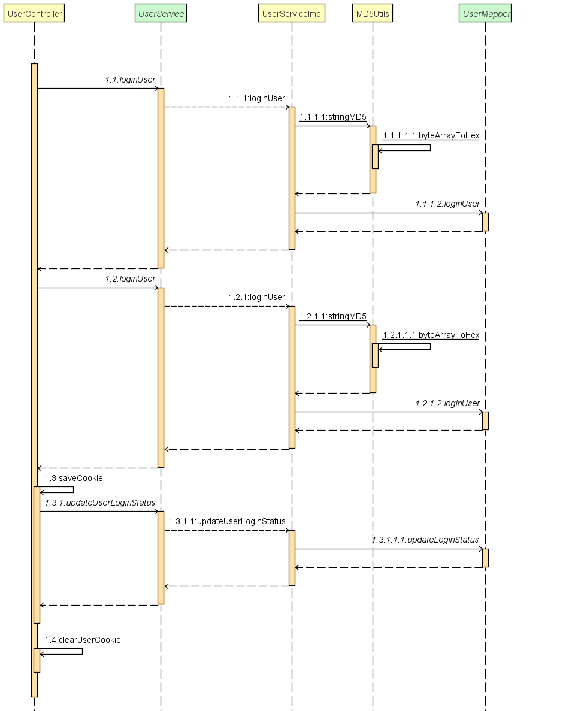

## 测试标题

测试


```
package com.clear.fillter;

import javax.servlet.*;
import javax.servlet.http.HttpServletRequest;
import javax.servlet.http.HttpServletResponse;
import java.io.IOException;

/**
 * @author: CLEARLi
 * @date: 2020/4/6
 * @description 一般类
 */
public class RefererFilter implements Filter {
    @Override
    public void init(FilterConfig filterConfig) throws ServletException {

    }

    @Override
    public void doFilter(ServletRequest servletRequest, ServletResponse servletResponse, FilterChain filterChain) throws IOException, ServletException {
        HttpServletRequest request = (HttpServletRequest) servletRequest;
        HttpServletResponse response = (HttpServletResponse) servletResponse;
        String referer = request.getHeader("referer");
        //获取请求地址
        System.out.println(referer);
        String serverName = request.getServerName();
        if (referer==null||!referer.contains(serverName)){
            request.getRequestDispatcher("/static/error.png").forward(request,response);
            return;
        }
        filterChain.doFilter(request,response);
    }

    @Override
    public void destroy() {

    }
}

```



